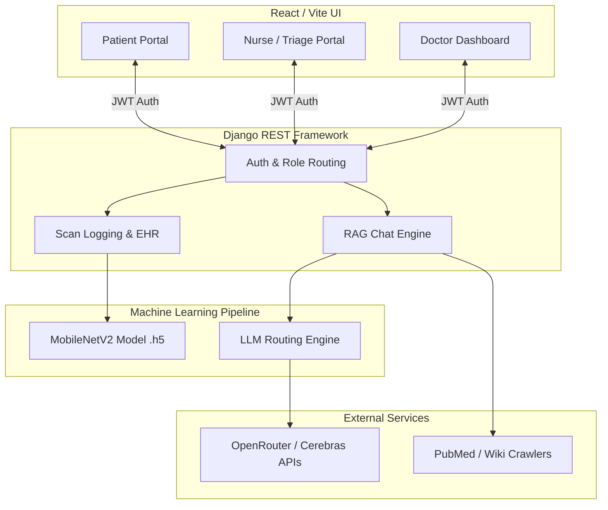

<div align="center">
  

  # 🧬 GenVeda Clinical Intelligence
  
  **A Next-Generation AI-Powered Dermatology & Clinical Workflow Platform Built for Bharat**

  [](https://reactjs.org/)
  [](https://www.djangoproject.com/)
  [](https://www.tensorflow.org/)
  [](https://vitejs.dev/)
  [](https://opensource.org/licenses/MIT)
</div>

---

## 📖 Overview

**GenVeda Clinical Intelligence** is a cutting-edge, full-stack medical triage and AI diagnostics platform designed specifically for rural clinics and multi-tier healthcare environments. 

By combining real-time edge AI skin lesion analysis, Multilingual Retrieval-Augmented Generation (RAG), and a strictly sandboxed multi-role architecture, GenVeda bridges the gap between resource-constrained primary care centers and specialized dermatologists. 

Built with the vision of **"Made for India"**, GenVeda natively supports local languages like Kannada and English, features voice-assisted dictation, and integrates directly with USB Dermoscopes.

---

## ✨ Core Innovations

### 🧠 1. Real-Time AI Diagnosis Engine
- **Edge-Optimized CNN:** Powered by a custom **MobileNetV2** architecture trained on the HAM10000 dataset.
- **7-Class Classification:** Accurately detects Melanocytic Nevus, Melanoma, Benign Keratosis, Basal Cell Carcinoma, Actinic Keratosis, Vascular Lesions, and Dermatofibroma.
- **Explainable AI (XAI):** Returns full softmax probability arrays and computes weighted clinical risk scores (`0-100%`) for transparent decision making.

### 🤖 2. Multilingual RAG AI Assistant
- **Contextual Medical Chat:** Answers patient and clinician queries using real-time medical context crawled from PubMed, Wikipedia, and DuckDuckGo.
- **Native Language Enforcement:** The AI detects and strictly responds in the user's native language (e.g., Kannada to Kannada), ensuring zero language barriers.
- **High-Availability LLM Failover:** Primary reasoning powered by advanced models with an automatic, silent failover to OpenRouter (Llama 3.1 8B, Gemma 3, Mistral) ensuring 99.9% uptime.

### 🚨 3. Smart Clinical Escalation
- **Autonomous Triage:** Scans returning an AI confidence score of `HIGH` risk automatically bypass standard queues.
- **Immediate Intervention:** Generates urgent Order IDs (e.g., `GV-0042`) directly in the Doctor's **Immediate Cases** dashboard for rapid review.

### 🔒 4. Blockchain-Secured EHR & Voice Features
- **Cryptographic Records:** Patient EHRs and scan logs are cryptographically secured using SHA-256 hashing.
- **Voice-Assisted Clinical Notes:** Built-in browser-native speech-to-text allows nurses and doctors to dictate prescriptions and notes in English or Kannada effortlessly.

---


## 🏗 System Architecture



---

## 🛠 Tech Stack

### Frontend
- **Framework:** React 18 with Vite for blazing fast HMR.
- **Styling:** Tailwind CSS & Custom CSS Custom Properties for seamless Dark/Light theming.
- **Routing:** `react-router-dom` with robust `RoleRoute` interceptors.
- **State & i18n:** Custom React Contexts for dynamic Language (English/Kannada) and Theme switching.

### Backend
- **Framework:** Django 5.x, Django REST Framework (DRF)
- **Database:** SQLite3 (Configured for standard relational modeling)
- **Security:** JWT Bearer Token Authentication.

### Machine Learning
- **Computer Vision:** TensorFlow, Keras, OpenCV, Pillow.
- **NLP / RAG:** Python Requests, Regex Sanitizers, Dynamic Prompt Engineering.

---

## 🚀 Getting Started

Follow these steps to run the GenVeda platform locally.

### Prerequisites
- **Python** (v3.10 or higher)
- **Node.js** (v18.x or higher)
- **Git**

### 1. Backend Setup

Open a terminal and navigate to the `backend` folder:

```bash
cd backend

# Create and activate a virtual environment
python -m venv venv
# Windows
.\venv\Scripts\activate
# MacOS/Linux
source venv/bin/activate

# Install Dependencies
pip install -r requirements.txt

# Run Migrations
python manage.py makemigrations APIs
python manage.py migrate

# Start the Django Server
python manage.py runserver
```
*The backend server will run on `http://127.0.0.1:8000/`*

### 2. Frontend Setup

Open a new terminal and navigate to the `frontend` folder:

```bash
cd frontend

# Install Dependencies
npm install

# Start the Vite Development Server
npm run dev
```
*The frontend application will boot up at `http://localhost:5173/`*

### 3. Environment Variables

If you wish to test the RAG chatbot features, create a `.env` file in the `backend` folder with the following API keys:
```env
CEREBRAS_API_KEY=your_cerebras_key_here
OPENROUTER_API_KEY=your_openrouter_key_here
```

---

## 👥 Role-Based Workflows

### 👨‍⚕️ The Doctor Portal
- **Dashboard Overview:** High-level metrics, recent patient scans, and urgent queue monitoring.
- **Immediate Cases:** Auto-populated dashboard of AI-escalated high-risk lesions requiring instant intervention.
- **Clinical Insights:** RAG-powered assistant connected to medical literature for evidence-based decision support.

### 👩‍⚕️ The Nurse/Triage Portal
- **Scan & Input:** Fast capture of patient symptoms, duration, and clinical images via USB Dermoscope or webcam.
- **Result & Escalation:** Pre-screening AI results. Nurses can manually escalate cases or rely on the AI's auto-escalation trigger.
- **Voice Documentation:** Dictate patient history directly into the portal.

### 👤 The Patient Experience
- **Symptom Checker:** Intuitive, multi-step flow to report symptoms securely.
- **My Reports:** Full-width digital medical records displaying risk categories in human-readable, translated terms.
- **Health Assistant:** Friendly, non-diagnostic AI support to help patients understand when to seek immediate care.

---

<div align="center">
  <br />
  <p><i>Engineered for the Alvas Hackathon — Building the Future of Accessible Healthcare.</i></p>
</div>
